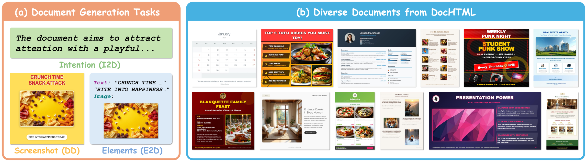
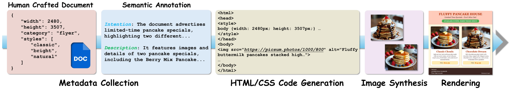
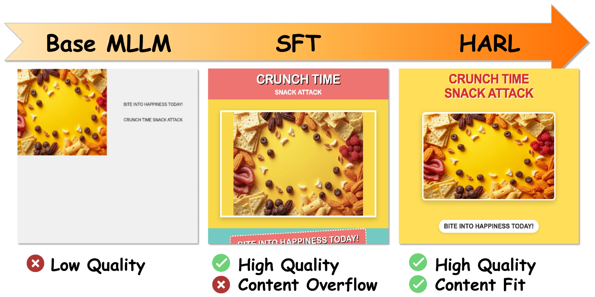

# AnyDoc: Enhancing Document Generation via Large-Scale HTML/CSS Data Synthesis and Height-Aware Reinforcement Optimization

<p align="center">
  <a href="https://openaccess.thecvf.com/content/CVPR2026/html/Lin_AnyDoc_Enhancing_Document_Generation_via_Large-Scale_HTMLCSS_Data_Synthesis_and_CVPR_2026_paper.html"></a>
  <a href="https://arxiv.org/abs/2603.25118"></a>
  
</p>

**Jiawei Lin**<sup>\*</sup> (Xi'an Jiaotong University) &nbsp;•&nbsp;
**Wanrong Zhu** (Adobe Research) &nbsp;•&nbsp;
**Vlad I. Morariu** (Adobe Research) &nbsp;•&nbsp;
**Christopher Tensmeyer** (Adobe Research)

<sub><sup>\*</sup>Work done during an internship at Adobe Research.</sub>

📄 [Paper (CVPR 2026)](https://openaccess.thecvf.com/content/CVPR2026/html/Lin_AnyDoc_Enhancing_Document_Generation_via_Large-Scale_HTMLCSS_Data_Synthesis_and_CVPR_2026_paper.html) &nbsp;|&nbsp;
📄 [arXiv](https://arxiv.org/abs/2603.25118)

<p align="center">
  
</p>

---

## Overview

Document generation has gained growing attention in AI-driven content creation.
**AnyDoc** is a framework capable of handling multiple generation tasks across a
wide spectrum of document categories, all represented in a unified **HTML/CSS**
format. Unlike prior work that generates documents as raster images (not
editable) or flat coordinate sequences (poor at complex layouts), AnyDoc adopts
a hierarchical, multi-layered HTML/CSS representation that is both expressive and
fully editable.

AnyDoc contributes:

- **DocHTML** — a large-scale, automatically synthesized dataset of **265,206**
  document samples spanning **111 categories** and **32 styles**, each with rich
  metadata, HTML/CSS source code, visual assets, and rendered screenshots.
- **Supervised fine-tuning (SFT)** of a multi-modal LLM (Qwen2.5-VL-7B-Instruct)
  on DocHTML for three practical tasks.
- **Height-Aware Reinforcement Learning (HARL)** — a GRPO-based post-training
  procedure that penalizes content overflow using a reward based on the
  difference between predicted and target document heights.

AnyDoc outperforms both general-purpose MLLMs and task-specific baselines across
all three tasks.

### Tasks

| Task | Input | Output |
| --- | --- | --- |
| **Intention-to-Document (I2D)** | Natural-language design intention (+ category, style, dimensions) | HTML/CSS document |
| **Document Derendering (DD)** | Document screenshot (+ dimensions) | HTML/CSS document |
| **Element-to-Document (E2D)** | Set of text and image elements (+ dimensions) | HTML/CSS document |

## DocHTML Dataset

DocHTML is built with an automated data synthesis pipeline: metadata collection →
semantic annotation (InternVL3) → HTML/CSS code generation (Qwen3-Coder-480B) →
image asset synthesis (FLUX.1-dev) → rendering (Playwright) → data cleaning.

<p align="center">
  
</p>

Each sample provides:

- **Metadata** — document category, styles, dimensions, design intention, and a
  factual content description.
- **HTML/CSS source code** — a hierarchical, fully editable document.
- **Synthesized image assets** — generated for every `` placeholder.
- **Rendered screenshot** — the document rasterized with Playwright.

| | |
| --- | --- |
| Samples | 265,206 |
| Categories | 111 |
| Styles | 32 |
| Train / Val / Test split | 8 : 1 : 1 |

The dataset is delivered as Parquet tables (with per-page-variation rows for the
three task framings) plus sharded tarballs of rendered screenshots and
per-instance image assets. The release **also includes the model predictions for
the paper's experiments** (outputs of AnyDoc and the baselines on the benchmark
splits) and the **VLM-as-judge and derendering scores** computed for those
predictions. See **[DATASET.md](DATASET.md)** for the full row schema, split
definitions, media layout, and the predictions/scores tables.

> ⚠️ **Image-asset restriction.** The synthesized image assets were generated
> with FLUX.1-dev and carry an additional non-commercial restriction: they may
> not be used to train, fine-tune, or distill a model competitive with FLUX.1
> [dev] / FLUX.1 Kontext [dev]. See [FLUX_LICENSE_NOTES.md](FLUX_LICENSE_NOTES.md).

## Method

<p align="center">
  
</p>

General-purpose MLLMs produce low-quality documents. SFT on DocHTML yields strong
document-generation capability but still exhibits **content overflow**, where
elements extend beyond the specified document height. HARL addresses this with a
height-aware reward computed from the ratio ρ = ĥ / h between the rendered height
ĥ and the target height h — penalizing both overflow (ρ > 1) and underflow
(ρ < 1 − γ) to prevent reward hacking.

## Prompts

The model prompts used in the dataset construction pipeline and baselines are
provided as plain text (with `{...}` placeholders) in [`prompts/`](prompts/):

- [`01_intention_and_description_annotation.txt`](prompts/01_intention_and_description_annotation.txt)
- [`02_html_css_code_generation.txt`](prompts/02_html_css_code_generation.txt)
- [`03_baseline_task_instructions.txt`](prompts/03_baseline_task_instructions.txt)
- [`04_flux_i2d_baseline.txt`](prompts/04_flux_i2d_baseline.txt)

> **Note.** This repository does **not** release training or inference code.

## Accessing the DocHTML Dataset and Model Checkpoints

The DocHTML dataset and the AnyDoc model checkpoints (SFT + HARL) are **available
now** under the [Adobe Research License](LICENSE.txt). To request access, email
**Christopher Tensmeyer** at **tensmeye@adobe.com** with:

- **Subject:** `Access to DocHTML Dataset`
- **Body:** a statement acknowledging that you understand and agree to the terms
  of the [Adobe Research License](LICENSE.txt).

Once your request is received, you will be provided with download instructions
for both the dataset and the model checkpoints.

> By requesting and using these materials you agree to the terms of the Adobe
> Research License.

## Citation

If you find AnyDoc or DocHTML useful in your research, please cite:

```bibtex
@InProceedings{Lin_2026_CVPR,
    author    = {Lin, Jiawei and Zhu, Wanrong and I Morariu, Vlad and Tensmeyer, Christopher},
    title     = {AnyDoc: Enhancing Document Generation via Large-Scale HTML/CSS Data Synthesis and Height-Aware Reinforcement Optimization},
    booktitle = {Proceedings of the IEEE/CVF Conference on Computer Vision and Pattern Recognition (CVPR)},
    month     = {June},
    year      = {2026},
    pages     = {626-635}
}
```

## License

The DocHTML dataset and AnyDoc model checkpoints are released under the
[Adobe Research License](LICENSE.txt) (noncommercial research use only).

The synthesized image assets are additionally subject to the FLUX.1 [dev]
Non-Commercial License v1.1.1 — see [FLUX_LICENSE_NOTES.md](FLUX_LICENSE_NOTES.md).
